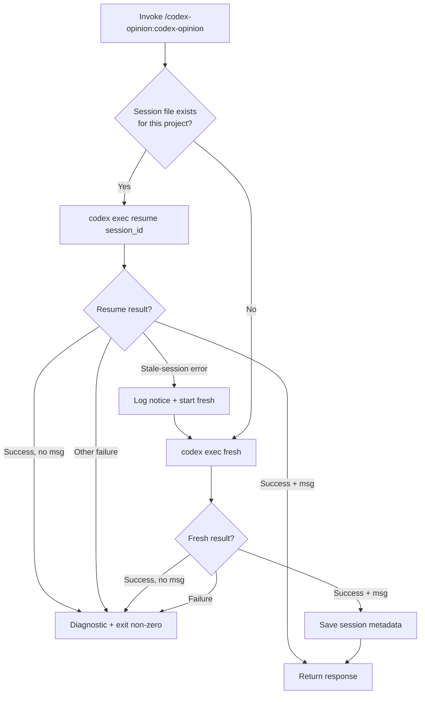
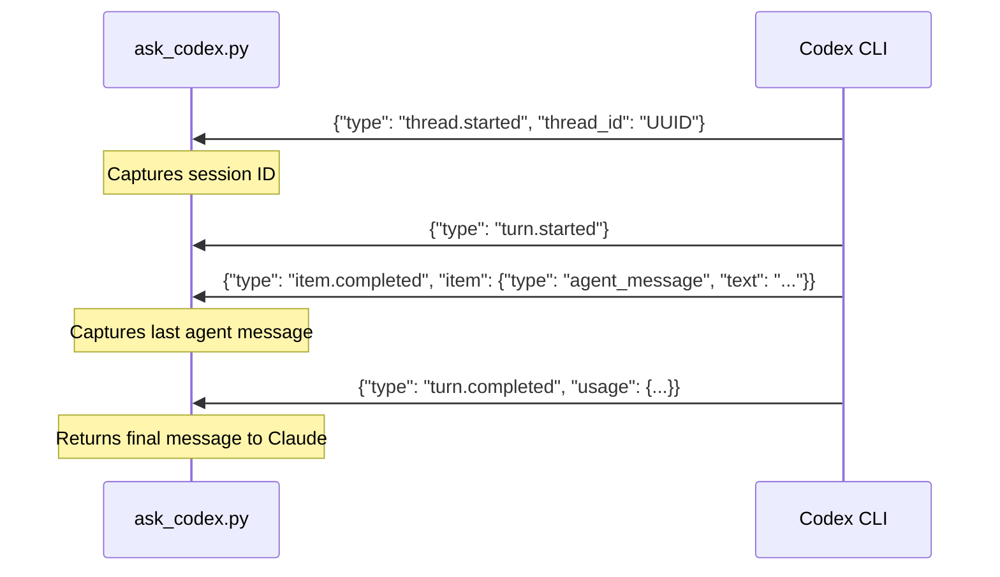

# codex-opinion internals

Implementation details for contributors and maintainers. User-facing docs live in [README.md](README.md).

## Protocol vs transport boundary

Reconciliation protocol (when to call Codex, how to frame the briefing, when to audit the reconciled draft, when to run a closing revision check) lives in [`SKILL.md`](plugins/codex-opinion/skills/codex-opinion/SKILL.md) and Claude's judgment at runtime. [`ask_codex.py`](plugins/codex-opinion/skills/codex-opinion/scripts/ask_codex.py) intentionally remains prompt transport only: stdin in, Codex call, reply out, per-project session state saved atomically. When `CODEX_OPINION_SESSION_KEY` is set in the environment, the state key includes a hash of that value, giving that caller a separate Codex thread for the same project.

Multi-round behavior — initial briefing, audit call, closing revision check — is produced by Claude invoking the same script multiple times on the resumed Codex thread with explicit per-call briefings. The script does not count rounds, detect cycle boundaries, or parse Codex's response. Adding protocol state to the script would mix transport with judgment and create edge cases around idempotency, concurrent invocations, and what counts as "stable."

If you want protocol enforcement in Python rather than skill-level discipline, that is a different project shape than this repo — a protocol engine, not a transport shim.

## Session management flowchart

## JSONL protocol

`ask_codex.py` communicates with `codex exec --json` via JSONL events on stdout:

`extract_session_id` parses `thread.started` events; `extract_final_message` captures the last `agent_message` from any `item.completed` event. If the Codex CLI JSONL format changes (new event shapes, renamed keys), update those two functions in [`plugins/codex-opinion/skills/codex-opinion/scripts/ask_codex.py`](plugins/codex-opinion/skills/codex-opinion/scripts/ask_codex.py).
