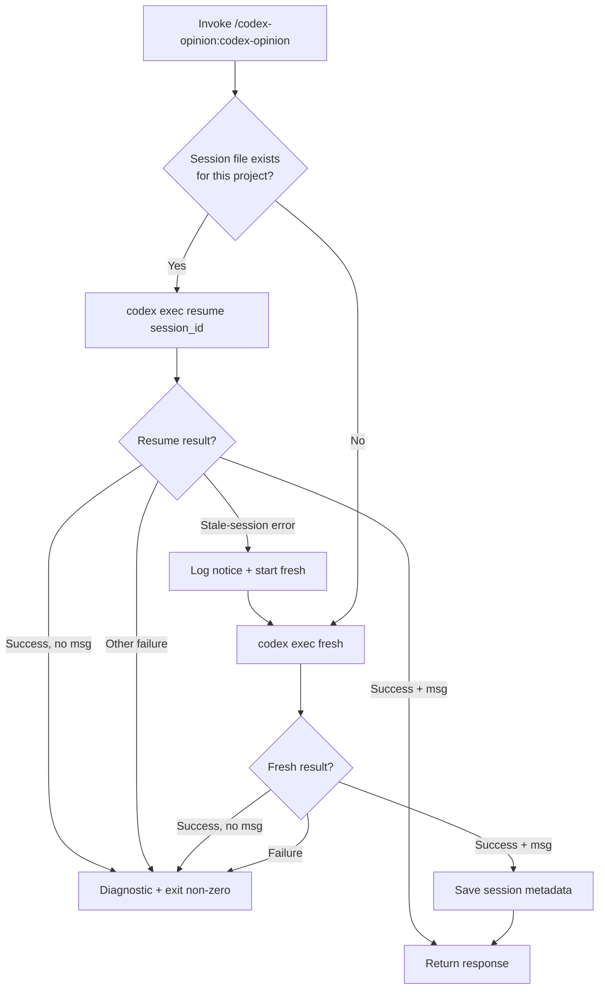
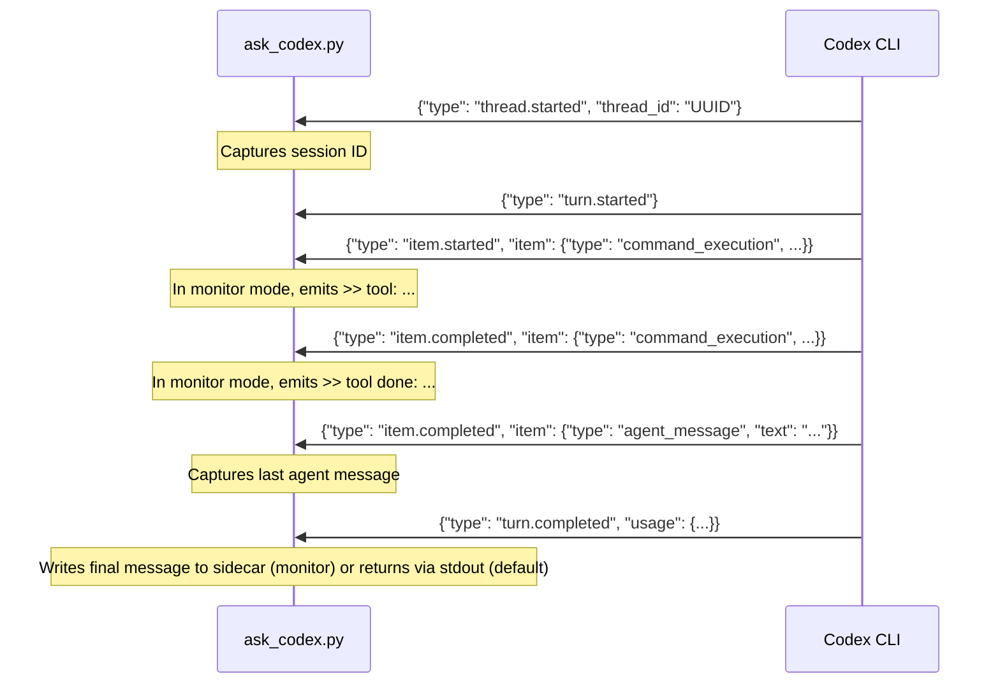

# codex-opinion internals

Implementation details for contributors and maintainers. User-facing docs live in [README.md](README.md).

## Protocol vs transport boundary

Reconciliation protocol (when to call Codex, how to frame the briefing, when to audit the reconciled draft, when to run a closing revision check) lives in [`SKILL.md`](plugins/codex-opinion/skills/codex-opinion/SKILL.md) and Claude's judgment at runtime. [`ask_codex.py`](plugins/codex-opinion/skills/codex-opinion/scripts/ask_codex.py) stays on the transport side of that line: it takes a briefing on stdin and drives `codex exec`. It does parse Codex's JSONL — that's unavoidable for session-id capture, final-message extraction, and (in monitor mode) compact progress emission — but it does not count rounds, detect reconciliation cycles, or shape what Claude says next. When `CODEX_OPINION_SESSION_KEY` is set in sync modes, the session-state key includes a hash of it, giving that caller a separate Codex thread for the same project. Detach mode runs are recorded as per-job manifests under `$STATE_DIR/jobs/`, separate from the sync-mode session file.

Multi-round behavior — initial briefing, audit call, closing revision check — is produced by Claude invoking the same script multiple times on the resumed Codex thread with explicit per-call briefings. The script does not count rounds or detect cycle boundaries. Adding protocol state to the script would mix transport with judgment and create edge cases around idempotency, concurrent invocations, and what counts as "stable."

If you want protocol enforcement in Python rather than skill-level discipline, that is a different project shape than this repo — a protocol engine, not a transport shim.

## Session management flowchart (sync modes only)

Applies to `off` and `monitor`. Detach mode bypasses project session state entirely; see the *Detach / watch / collect* section below.



## JSONL protocol

`ask_codex.py` communicates with `codex exec --json` via JSONL events on stdout:



`extract_session_id` parses `thread.started` events; `extract_final_message` captures the last `agent_message` from any `item.completed` event. `_event_to_progress_line` translates events into compact `>> …` lines for monitor mode. If the Codex CLI JSONL format changes (new event shapes, renamed keys), update those three functions in [`plugins/codex-opinion/skills/codex-opinion/scripts/ask_codex.py`](plugins/codex-opinion/skills/codex-opinion/scripts/ask_codex.py).

## Streaming architecture

`_run_codex_stream_async` is the asyncio event-loop driver. It spawns `codex exec --json` via `asyncio.create_subprocess_exec` with `start_new_session=True` (the async equivalent of `preexec_fn=os.setsid`, swapped in v1.5.1 to avoid `preexec_fn`'s fork/async-safety hazards) so SIGTERM/SIGKILL escalation targets the whole process group. It concurrently gathers three tasks:

- `_feed_stdin` writes the prompt and closes stdin without blocking the loop.
- `_drain_stdout` iterates the child's stdout line-by-line; in streaming mode each decoded line is parsed as JSON and, if it carries a progress signal, a compact `>> …` string is printed immediately to this script's own stdout (where Claude Code's `Monitor` tool picks it up).
- `_drain_stderr` accumulates stderr so no buffer ever fills and deadlocks the child.

```mermaid
sequenceDiagram
    participant C as Claude Code (Monitor)
    participant S as ask_codex.py (async)
    participant L as event loop
    participant X as codex exec

    C->>S: bash -lc 'CODEX_OPINION_STREAM=monitor … | ask_codex.py'
    S->>L: asyncio.run(run_codex_async)
    L->>X: create_subprocess_exec (own session)
    par stdin
        L->>X: prompt bytes
    and stdout drain
        X-->>L: JSONL event
        L-->>S: _event_to_progress_line
        S-->>C: >> ... (live notification)
    and stderr drain
        X-->>L: stderr chunk
        L->>S: accumulate
    end
    Note over S: JSONL parsing and session save happen in the script; Claude Code never arbitrates transport correctness.
    S-->>C: >> final-message: <sidecar path>
```

No timeout is enforced on the subprocess. No threads are used — concurrency is entirely `asyncio.gather`. Keyboard interrupts and exceptions cancel all in-flight tasks and escalate termination through `SIGTERM` → `SIGKILL` on the process group.

## Detach / watch / collect (v1.6.0)

`CODEX_OPINION_STREAM=detach` spawns codex fully detached and exits immediately. The child runs to completion on its own timeline — hours, days, or weeks — surviving Claude Code tool-call lifecycles and Monitor's 1-hour ceiling. State lives on disk under `$STATE_DIR/jobs/<job-id>/`:

- `manifest.json` — `{job_id, pid, cmd, prompt_path, log_path, err_path, sidecar_path, project_path, started_at}`
- `prompt.txt` — the briefing piped into codex's stdin
- `log.jsonl` — codex's stdout (raw JSONL events)
- `err.log` — codex's stderr
- `lastmsg.txt` — the final agent_message, written by codex's `-o` flag

`_spawn_codex_detached` uses `subprocess.Popen(..., start_new_session=True, close_fds=True)` with stdio pre-redirected to file handles. After spawn, the parent closes its fd copies (the child retains its own) and returns just the PID; the Popen instance goes out of scope and the kernel reparents the child to init when we exit.

Detached jobs do not touch the project's session state. Each detach is a fresh codex thread — this is deliberate, both to avoid concurrent-write races with synchronous calls on the same project and because detach is meant for fire-and-forget long runs, not for chained multi-turn reconciliation. `CODEX_OPINION_SESSION_KEY` is recorded into the manifest for debugging only; cross-job continuity (resuming one detached job's thread in a later detached job) is a deliberate non-goal for now — implementing it would require either a concurrent-safe session-save reaper that watches log files, or a daemon, and we rejected both.

`CODEX_OPINION_STREAM=watch` (with `CODEX_OPINION_JOB_ID=<id>`) opens the job's `log.jsonl` and polls for new content, emitting compact progress lines as events arrive. Uses `os.kill(pid, 0)` to detect process death; after the process dies, reads trailing bytes and emits `>> final-message: <sidecar_path>`. Re-invocable across Monitor expiries — watch is a separate process from codex, so killing watch doesn't affect the detached codex.

`CODEX_OPINION_STREAM=collect` (with `CODEX_OPINION_JOB_ID=<id>`) reads the sidecar and prints its contents; errors if the job is still running or produced no message.
