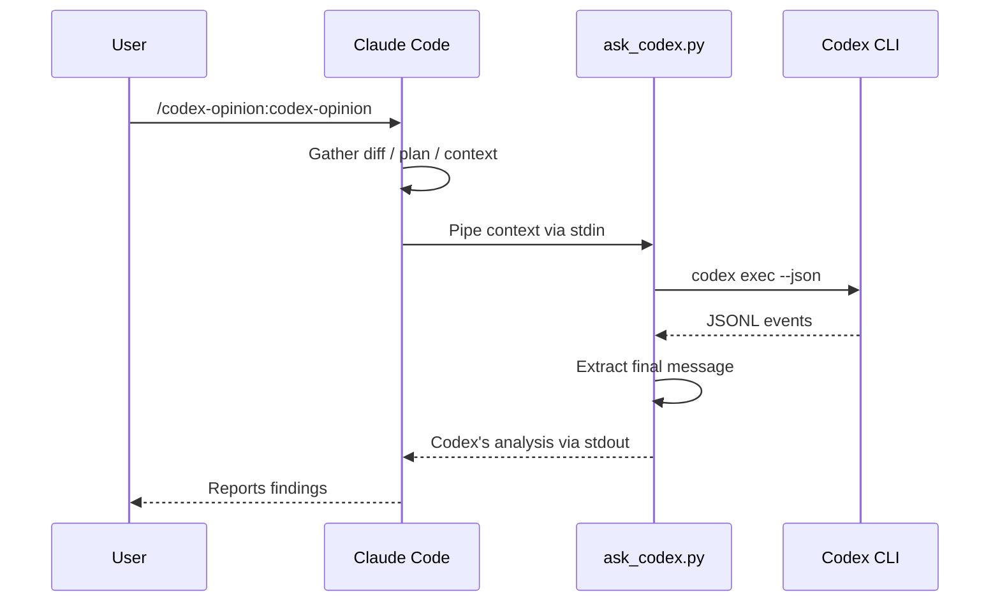
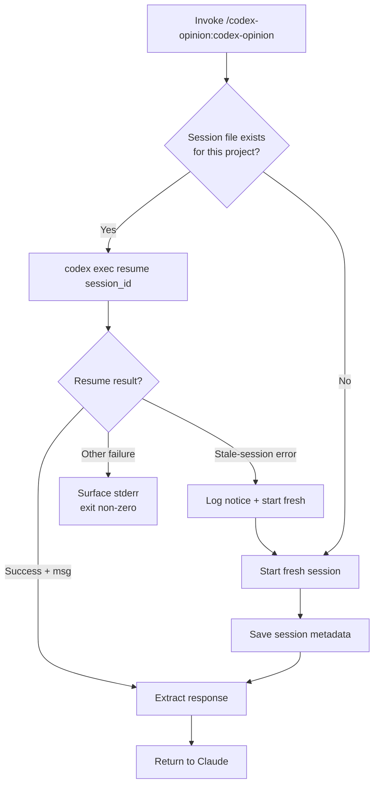
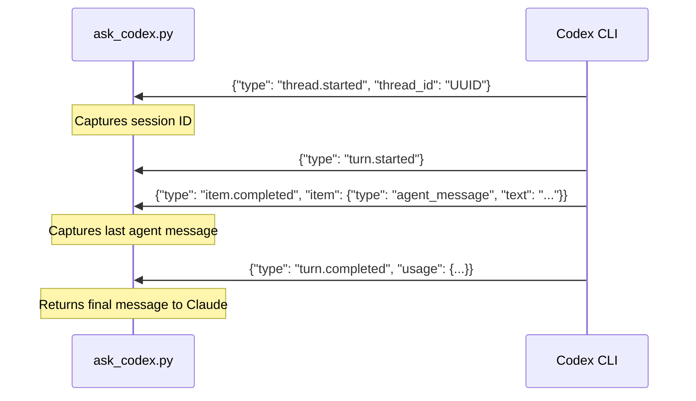

# codex-opinion

A Claude Code plugin that gets a second opinion from OpenAI's Codex CLI on your work.

## Prerequisites

- [Claude Code](https://claude.ai/code) — authenticated (`claude` in terminal)
- [OpenAI Codex CLI](https://developers.openai.com/codex/cli) — authenticated (`codex` in terminal)

Both must be logged in and working in your terminal before using this plugin.

## Install

```bash
claude plugins marketplace add ehzawad/codex-opinion
claude plugins install codex-opinion@codex-opinion
```

Persists across sessions — no flags needed.

### For development

```bash
git clone https://github.com/ehzawad/codex-opinion.git
claude --plugin-dir ./codex-opinion/plugins/codex-opinion
```

## Usage

```
/codex-opinion:codex-opinion
```

With a focus directive (appended to the default thorough-review prompt — does not replace it):

```
/codex-opinion:codex-opinion focus on security vulnerabilities
```

Claude Code also triggers the skill automatically when you ask for a second opinion in natural language — no slash command needed:

```
ask codex what it thinks about this diff
get a second opinion on my changes
```

## How it works

When invoked, Claude gathers your diff, plan, or context and pipes it to `codex exec`. Codex uses your configured model and settings from `~/.codex/config.toml`, reads the codebase, runs commands, and does deep analysis. Claude reads the response and reports back.



## Session management

One Codex session per project, stored at `~/.local/state/codex-opinion/{project-hash}.json`. Follow-up calls resume the prior Codex thread so it builds on its accumulated codebase knowledge — across Claude Code sessions, not just within one.

Resume failures are handled conservatively. Only known stale-session errors (the stored thread is missing/expired server-side) trigger a fresh restart. Other failures — auth, network, config, or a clean exit with no agent message — are surfaced verbatim and the script exits non-zero. This avoids silently re-running prompts that may have non-idempotent side effects under Codex's full filesystem access.



Concurrent invocations on the same project are allowed by design — independent Claude Code sessions can each run an opinion in parallel. State writes are atomic, so the JSON file never corrupts. Trade-off: a parallel first-time call may create a duplicate fresh thread, and rare clear/save races may orphan a thread. Net cost is at most a wasted re-learning round, never lost work.

## JSONL protocol

The script communicates with `codex exec --json` via JSONL events on stdout:



## Security

Codex runs with `--dangerously-bypass-approvals-and-sandbox` — no approval prompts, no filesystem sandbox. This gives Codex full read/write access to your machine so it can thoroughly inspect and analyze the codebase. Do not use this plugin on untrusted repositories or with untrusted input.

## Configuration

The script uses your Codex CLI defaults — model, reasoning effort, and other settings come from `~/.codex/config.toml`. No model is hardcoded. Sandbox and approval settings are overridden by the plugin (see Security above).

## License

MIT
