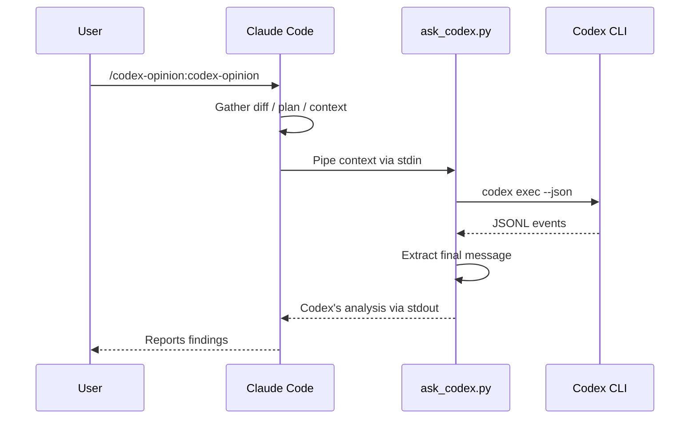
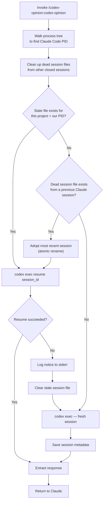
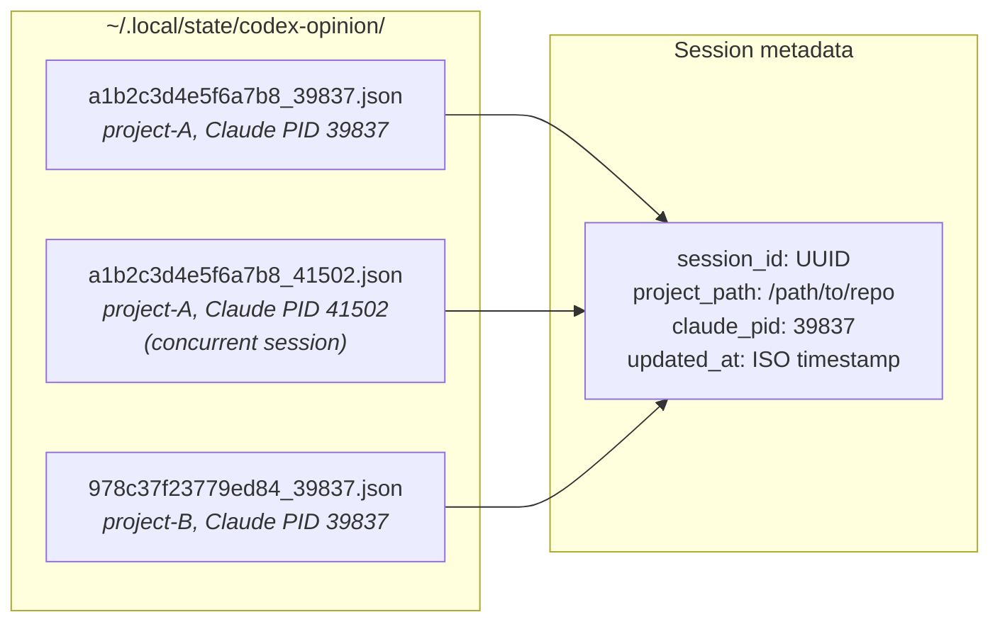
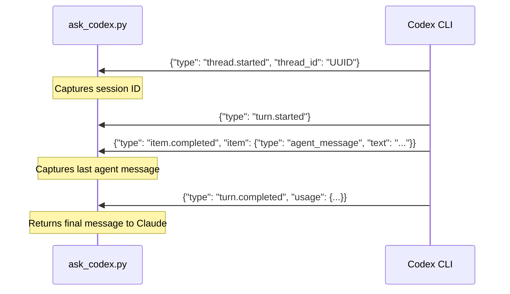

# codex-opinion

A Claude Code plugin that gets a second opinion from OpenAI's Codex CLI on your work.

## Prerequisites

- [Claude Code](https://claude.ai/code) — authenticated (`claude` in terminal)
- [OpenAI Codex CLI](https://developers.openai.com/codex/cli) — authenticated (`codex` in terminal)

Both must be logged in and working in your terminal before using this plugin.

## Install

```bash
claude plugins marketplace add ehzawad/codex-opinion
claude plugins install codex-opinion@codex-opinion
```

Persists across sessions — no flags needed.

### For development

```bash
git clone https://github.com/ehzawad/codex-opinion.git
claude --plugin-dir ./codex-opinion/plugins/codex-opinion
```

## Usage

Explicit:

```
/codex-opinion:codex-opinion
```

With a custom instruction:

```
/codex-opinion:codex-opinion focus on security vulnerabilities
```

Claude Code also triggers the skill automatically when you ask for a second opinion in natural language — no slash command needed:

```
ask codex what it thinks about this diff
get a second opinion on my changes
```

## How it works

When invoked, Claude gathers your diff, plan, or context and pipes it to `codex exec`. Codex uses your configured model and settings from `~/.codex/config.toml`, reads the codebase, runs commands, and does deep analysis. Claude reads the response and reports back.



## Session management

Sessions are scoped per **Claude Code session** and per **project**, with continuity across sequential sessions. The script walks up the process tree to find the Claude Code process and uses its PID as part of the session key. This means:

- **Same Claude Code session**: follow-up calls resume the same Codex thread
- **New Claude Code session, same project**: adopts the Codex thread from the previous session — Codex keeps its accumulated codebase knowledge
- **Two concurrent Claude Code sessions**: each gets an independent Codex thread — no interference
- **Stale Codex sessions**: if the adopted Codex thread has expired server-side, logs a notice and starts fresh

State files are stored at `~/.local/state/codex-opinion/`.





## JSONL protocol

The script communicates with `codex exec --json` via JSONL events on stdout:



## Security

Codex runs with `--dangerously-bypass-approvals-and-sandbox` — no approval prompts, no filesystem sandbox. This gives Codex full read/write access to your machine so it can thoroughly inspect and analyze the codebase. Do not use this plugin on untrusted repositories or with untrusted input.

## Configuration

The script uses your Codex CLI defaults — model, reasoning effort, and other settings come from `~/.codex/config.toml`. No model is hardcoded. Sandbox and approval settings are overridden by the plugin (see Security above).

## License

MIT
