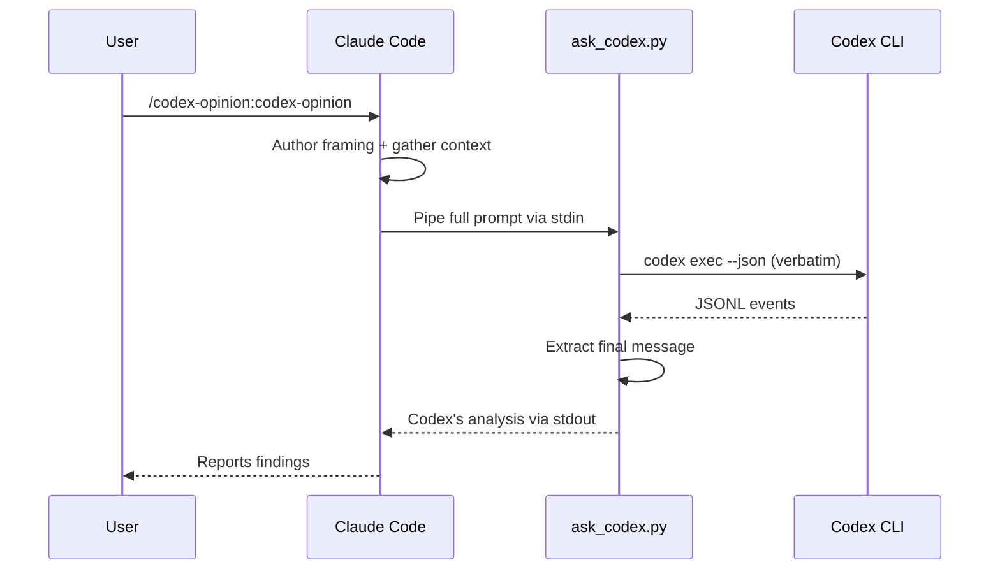
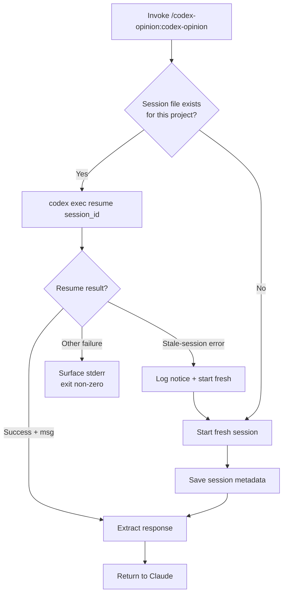
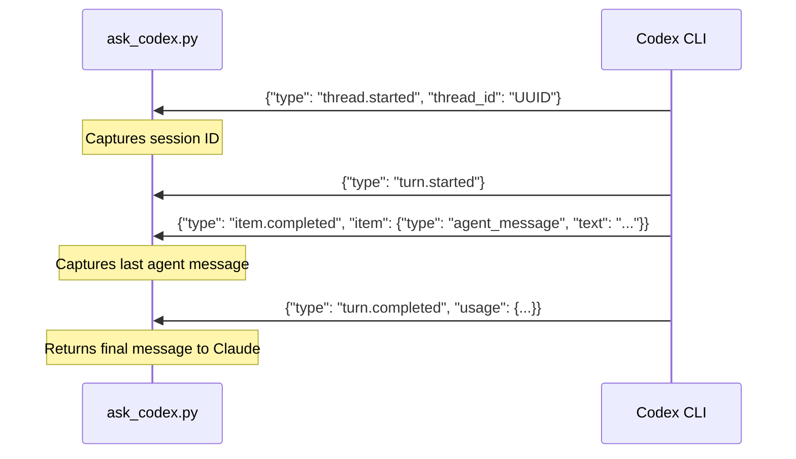

# codex-opinion

A Claude Code plugin that gets a second opinion from OpenAI's Codex CLI on your work.

## Prerequisites

- [Claude Code](https://claude.ai/code) — authenticated (`claude` in terminal)
- [OpenAI Codex CLI](https://developers.openai.com/codex/cli) — authenticated (`codex` in terminal)

Both must be logged in and working in your terminal before using this plugin.

## Install

```bash
claude plugins marketplace add ehzawad/codex-opinion
claude plugins install codex-opinion@codex-opinion
```

Persists across sessions — no flags needed.

### For development

```bash
git clone https://github.com/ehzawad/codex-opinion.git
claude --plugin-dir ./codex-opinion/plugins/codex-opinion
```

## Usage

```
/codex-opinion:codex-opinion
```

Add a directive in the same turn to steer the review:

```
/codex-opinion:codex-opinion focus on security vulnerabilities
```

Claude Code also triggers the skill automatically when you ask for a second opinion in natural language — no slash command needed:

```
ask codex what it thinks about this diff
get a second opinion on my changes
```

## How it works

The script is a pure transport: it pipes whatever Claude Code writes to stdin straight into `codex exec` (or `codex exec resume` when a prior session exists). There is no built-in review prompt inside the script. Claude Code authors the full prompt — framing, focus, and context — on each turn. On the first call for a project, Claude's framing establishes Codex's role; follow-up calls resume the same Codex thread, so Codex remembers the role and Claude only needs to send new context.

Codex uses your configured model and settings from `~/.codex/config.toml`, reads the codebase, runs commands, and does deep analysis. Claude reads the response and reports back.



## Session management

One Codex session per project, stored at `$XDG_STATE_HOME/codex-opinion/{project-hash}.json` (defaults to `~/.local/state/codex-opinion/...`). Follow-up calls resume the prior Codex thread so it builds on its accumulated codebase knowledge — across Claude Code sessions, not just within one.

Resume failures are handled conservatively. Only known stale-session errors (the stored thread is missing/expired server-side) trigger a fresh restart. Other failures — auth, network, config, or a clean exit with no agent message — are reported with their stderr (and a short diagnostic for the no-message case), and the script exits non-zero. This avoids silently re-running prompts that may have non-idempotent side effects under Codex's full filesystem access.



Concurrent invocations across *different* projects are fully isolated — each project keys to its own state file and therefore its own Codex thread. Concurrent invocations on the *same* project are allowed by design but share state: writes to the JSON file are atomic (it never corrupts), but once a session exists for that project every caller resumes the same remote Codex thread. Parallel same-project turns can interleave and muddle the review output. Parallel first-time calls on the same project can also create duplicate fresh threads — one wins the save, the others are orphaned. Net cost is a possibly-confused opinion or a wasted re-learning round, never lost code.

## JSONL protocol

The script communicates with `codex exec --json` via JSONL events on stdout:



## Security

Codex runs with `--dangerously-bypass-approvals-and-sandbox` — no approval prompts, no filesystem sandbox. This gives Codex full read/write access to your machine so it can thoroughly inspect and analyze the codebase. Do not use this plugin on untrusted repositories or with untrusted input.

## Configuration

The script uses your Codex CLI defaults — model, reasoning effort, and other settings come from `~/.codex/config.toml`. No model is hardcoded. Sandbox and approval settings are overridden by the plugin (see Security above).

No subprocess timeout is enforced. Codex sessions legitimately run for an hour on deep reviews, and real failures already surface via non-zero exit or a clean exit with no agent message (both handled). Runaway cases are bounded by outer layers — the Claude Code Bash/Monitor timeouts when invoked through Claude, or Ctrl+C in a direct shell.

## License

MIT
