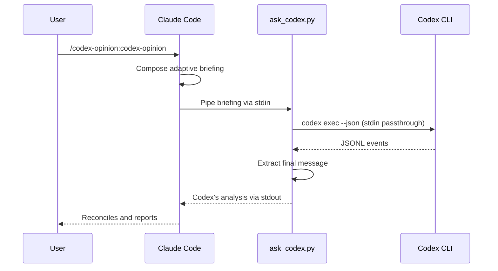
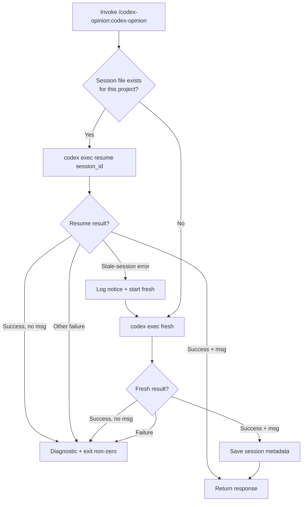
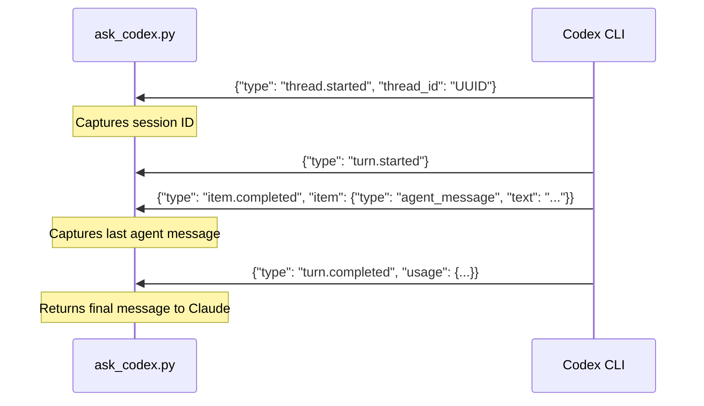

# codex-opinion

A Claude Code plugin that brings OpenAI's Codex CLI into your work as a distinct second model — not to review after the fact, but to reconcile with Claude on whatever you're doing right now. Three brains in the loop: you, Claude, and Codex.

## Philosophy

The adaptive briefing sits on top of a bedrock that holds regardless of task — invariants for how all three brains (human, Claude, Codex) operate:

- **Don't rot the context window — and don't starve it either** — include every material fact Codex needs to challenge assumptions; cut only procedural fluff. Summary-only briefings are worse than dumps.
- **Don't panic** — unexpected state isn't an emergency; find root causes.
- **Don't cheat** — no shortcuts that trade correctness for speed; no suppressing inconvenient findings.
- **Don't lie** — no unverified claims, no false confidence; uncertainty is honest.
- **Don't rush** — a thoughtful second opinion beats a fast one.
- **Don't be sycophantic** — disagreement with evidence is the point, not agreement by default.
- **Wrong, incomplete, and missing assumptions are where bugs and misalignments come from** — the reconciliation's main job is to surface them across all three brains.

## Prerequisites

- [Claude Code](https://claude.ai/code) — authenticated (`claude` in terminal)
- [OpenAI Codex CLI](https://developers.openai.com/codex/cli) — authenticated (`codex` in terminal)

Both must be logged in and working in your terminal before using this plugin.

## Install

```bash
claude plugins marketplace add ehzawad/codex-opinion
claude plugins install codex-opinion@codex-opinion
```

Persists across sessions — no flags needed.

### For development

Two options depending on how you iterate.

**Per-session try-out** — loads from disk for one session, no persistence:

```bash
git clone https://github.com/ehzawad/codex-opinion.git
claude --plugin-dir ./codex-opinion/plugins/codex-opinion
```

**Persistent dev loop** — for authors iterating on the plugin itself, so edits to the working tree are live without the commit/push/`plugins update`/restart cycle:

```bash
git clone https://github.com/ehzawad/codex-opinion.git
cd codex-opinion
claude plugins marketplace add ehzawad/codex-opinion    # skip if already added
claude plugins install codex-opinion@codex-opinion       # skip if already installed
./scripts/dev-link.sh
# restart Claude Code once
```

`scripts/dev-link.sh` replaces the installed version's cache directory (`~/.claude/plugins/cache/codex-opinion/codex-opinion/<version>/`) with a symlink to your working tree. Symlinks inside the plugin cache are officially supported — they resolve to their target at runtime.

After the one-time restart, edits to `plugins/codex-opinion/**` are live on the next `/codex-opinion:codex-opinion` invocation. **SKILL.md caveat:** the Claude Code harness's skill-content caching behavior is not documented, so `SKILL.md` edits may still require a session restart; the script and the rest of the plugin files update live.

Re-run `./scripts/dev-link.sh` after any `claude plugins update`, any version bump in `plugin.json` (the cache path changes with the version), or any cache wipe — each of these can replace the symlink with a freshly-fetched copy.

## Usage

```
/codex-opinion:codex-opinion
```

Add a directive in the same turn to steer the collaboration:

```
/codex-opinion:codex-opinion focus on migration risks
/codex-opinion:codex-opinion sanity-check this plan before I touch code
```

Claude Code also triggers the skill automatically when you ask in natural language — no slash command needed:

```
ask codex what it thinks
get a second opinion on this approach
have codex weigh in
sanity-check this before I start
another perspective on the trade-off
reconcile with codex
```

## How it works

The script is a pure transport: it pipes whatever Claude Code writes to stdin straight into `codex exec` (or `codex exec resume` when a prior session exists). There is no built-in prompt, no templates, no auto-bundling. Claude Code composes the full briefing every call — adapted to the current task, current phase, and the recent turns. On the first call per project, Claude's briefing establishes Codex's role; follow-up calls resume the same Codex thread so Codex carries accumulated codebase knowledge. Claude reframes explicitly when the task shifts (debug → plan → design → review) so prior framing doesn't bias later turns.

Codex uses your configured model and settings from `~/.codex/config.toml`, reads the codebase directly, runs commands, and does deep analysis. Claude reconciles Codex's response against its own assessment — agreements, specific disagreements, missed points — and reports the reconciled output to you.



## Session management

One Codex session per project, stored at `$XDG_STATE_HOME/codex-opinion/{project-hash}.json` (defaults to `~/.local/state/codex-opinion/...`). Follow-up calls resume the prior Codex thread so it builds on its accumulated codebase knowledge — across Claude Code sessions, not just within one.

Resume failures are handled conservatively. Only known stale-session errors (the stored thread is missing/expired server-side) trigger a fresh restart. Other failures — auth, network, config, or a clean exit with no agent message — are reported with their stderr (and a short diagnostic for the no-message case), and the script exits non-zero. This avoids silently re-running prompts that may have non-idempotent side effects under Codex's full filesystem access.



Concurrent invocations across *different* projects are fully isolated — each project keys to its own state file and therefore its own Codex thread. Concurrent invocations on the *same* project are allowed by design but share state: writes to the JSON file are atomic (it never corrupts), but once a session exists for that project every caller resumes the same remote Codex thread. Parallel same-project turns can interleave and muddle the review output. Parallel first-time calls on the same project can also create duplicate fresh threads — one wins the save, the others are orphaned. Net cost is a possibly-confused opinion or a wasted re-learning round, never lost code.

## JSONL protocol

The script communicates with `codex exec --json` via JSONL events on stdout:



## Security

Codex runs with `--dangerously-bypass-approvals-and-sandbox` — no approval prompts, no filesystem sandbox. This gives Codex full read/write access to your machine so it can thoroughly inspect and analyze the codebase. Do not use this plugin on untrusted repositories or with untrusted input.

## Configuration

The script uses your Codex CLI defaults — model, reasoning effort, and other settings come from `~/.codex/config.toml`. No model is hardcoded. Sandbox and approval settings are overridden by the plugin (see Security above).

No subprocess timeout is enforced. Codex sessions legitimately run for an hour on deep analyses, and real failures already surface via non-zero exit or a clean exit with no agent message (both handled). Runaway cases are bounded by outer layers — the Claude Code Bash/Monitor timeouts when invoked through Claude, or Ctrl+C in a direct shell.

## License

MIT
