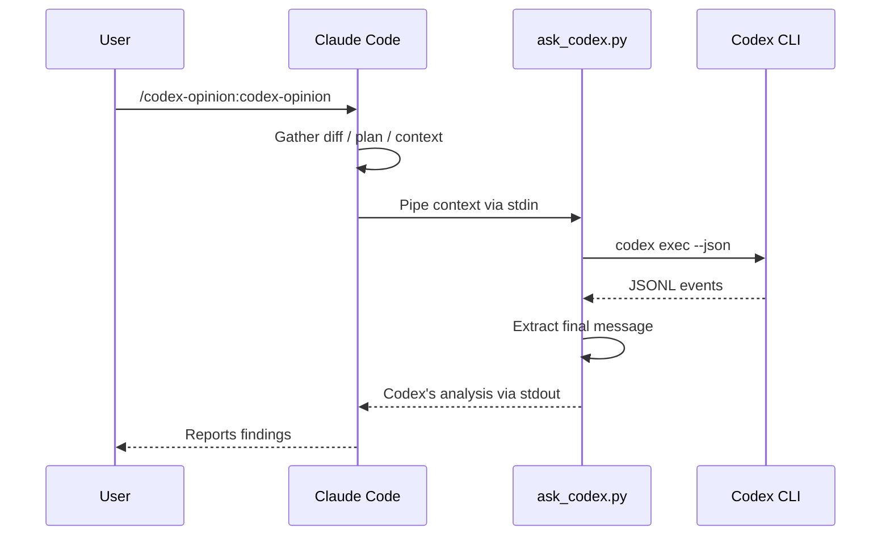
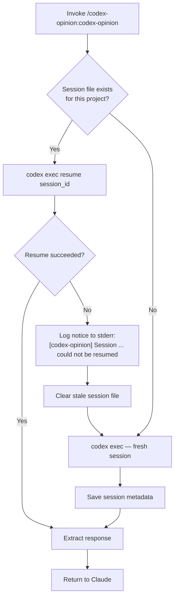
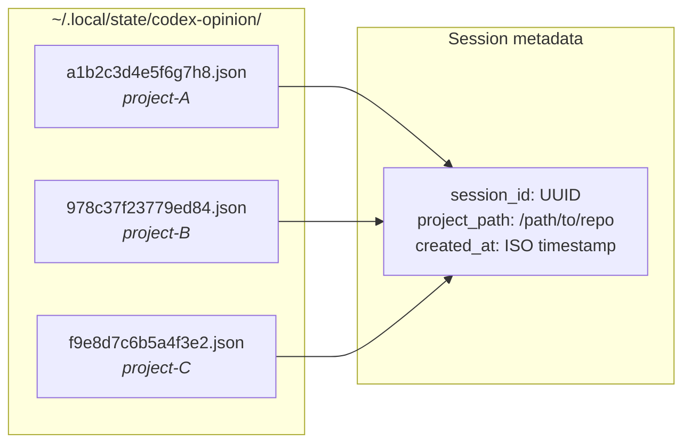
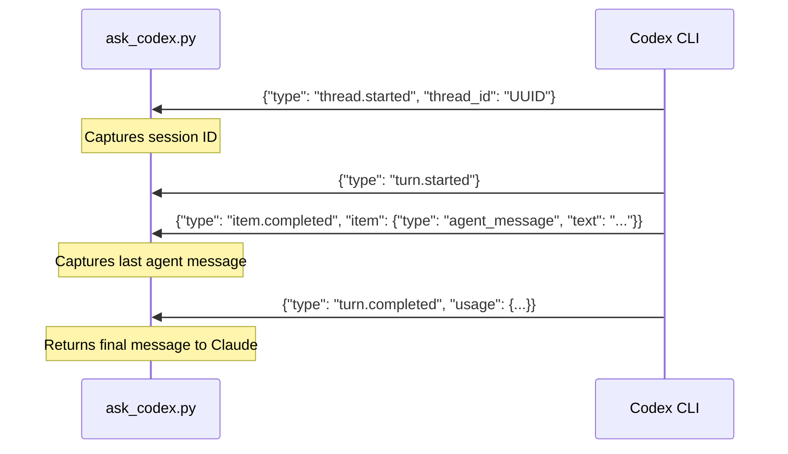

# codex-opinion

A Claude Code plugin that gets a second opinion from OpenAI's Codex CLI on your work.

## Prerequisites

- [Claude Code](https://claude.ai/code) — authenticated (`claude` in terminal)
- [OpenAI Codex CLI](https://developers.openai.com/codex/cli) — authenticated (`codex` in terminal)

Both must be logged in and working in your terminal before using this plugin.

## Install

```bash
claude plugins marketplace add ehzawad/codex-opinion
claude plugins install codex-opinion@codex-opinion
```

Persists across sessions — no flags needed.

### For development

```bash
git clone https://github.com/ehzawad/codex-opinion.git
claude --plugin-dir ./codex-opinion/plugins/codex-opinion
```

## Usage

```
/codex-opinion:codex-opinion
```

With a custom instruction:

```
/codex-opinion:codex-opinion focus on security vulnerabilities
```

## How it works

When invoked, Claude gathers your diff, plan, or context and pipes it to `codex exec`. Codex uses your configured model and settings from `~/.codex/config.toml`, reads the codebase, runs commands, and does deep analysis. Claude reads the response and reports back.



## Session management

Sessions are scoped per-project and stored at `~/.local/state/codex-opinion/`. Each git repo gets its own session file keyed by a hash of the repo root, so switching between projects won't cross-contaminate Codex threads.

Follow-up calls resume the prior session so Codex builds on its earlier analysis.





## JSONL protocol

The script communicates with `codex exec --json` via JSONL events on stdout:



## Configuration

The script uses your Codex CLI defaults — model, reasoning effort, and other settings come from `~/.codex/config.toml`. No model is hardcoded.

## License

MIT
