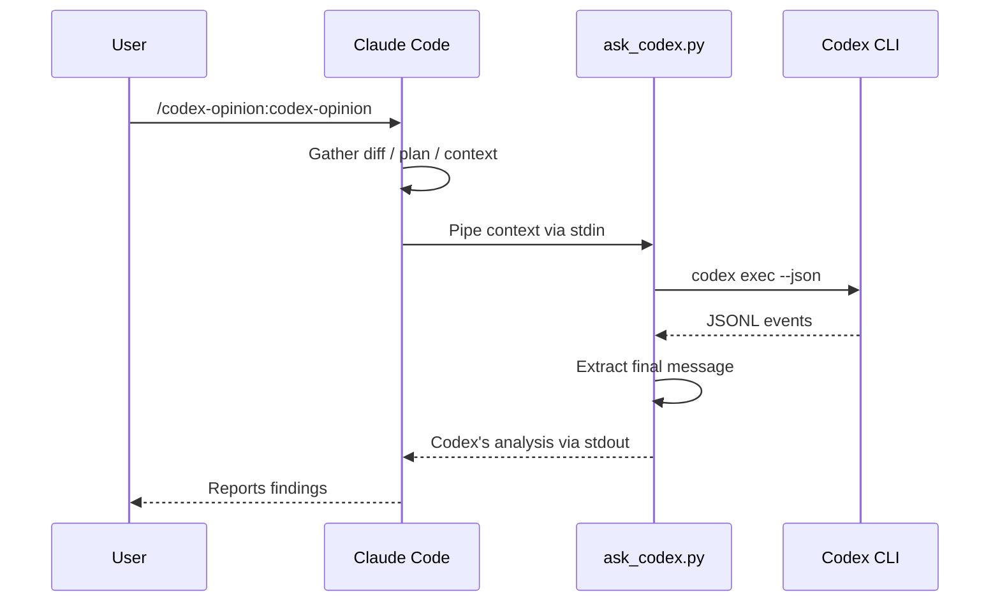
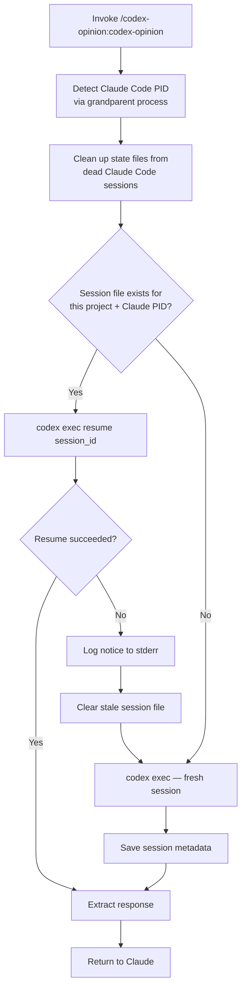
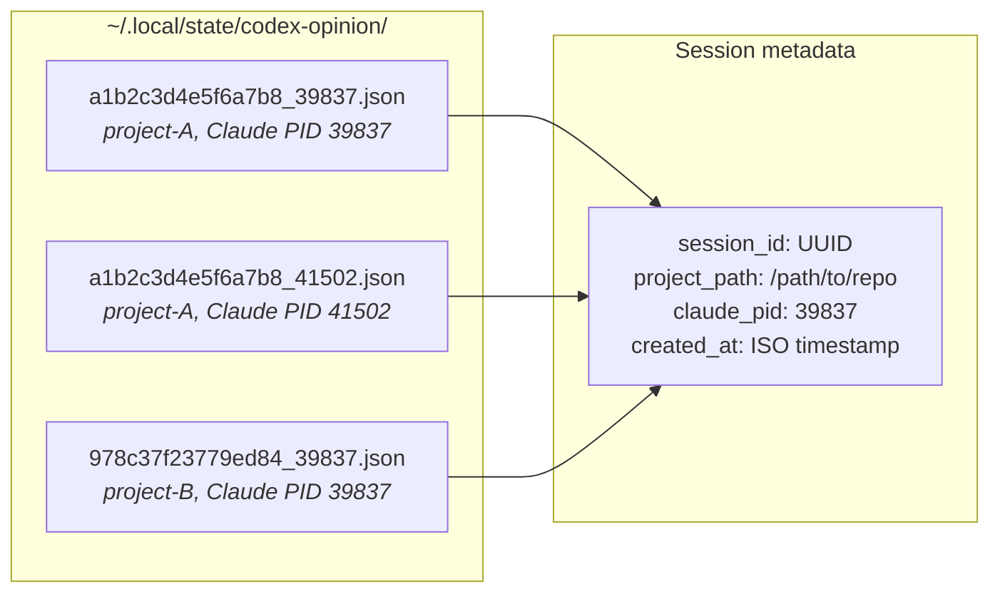
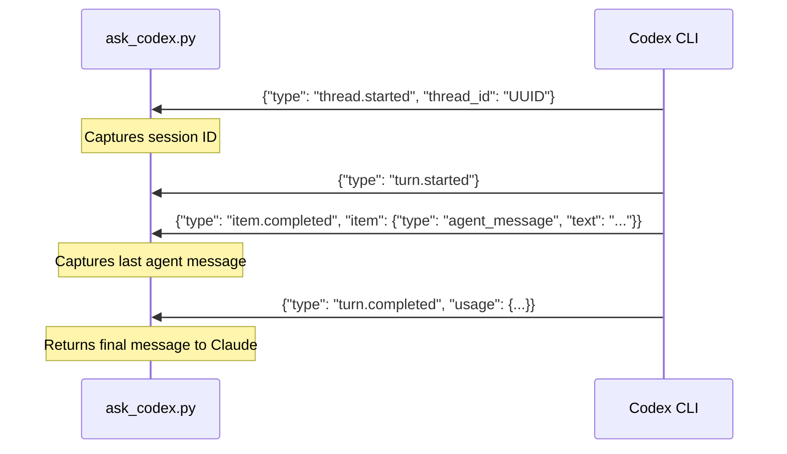

# codex-opinion

A Claude Code plugin that gets a second opinion from OpenAI's Codex CLI on your work.

## Prerequisites

- [Claude Code](https://claude.ai/code) — authenticated (`claude` in terminal)
- [OpenAI Codex CLI](https://developers.openai.com/codex/cli) — authenticated (`codex` in terminal)

Both must be logged in and working in your terminal before using this plugin.

## Install

```bash
claude plugins marketplace add ehzawad/codex-opinion
claude plugins install codex-opinion@codex-opinion
```

Persists across sessions — no flags needed.

### For development

```bash
git clone https://github.com/ehzawad/codex-opinion.git
claude --plugin-dir ./codex-opinion/plugins/codex-opinion
```

## Usage

```
/codex-opinion:codex-opinion
```

With a custom instruction:

```
/codex-opinion:codex-opinion focus on security vulnerabilities
```

## How it works

When invoked, Claude gathers your diff, plan, or context and pipes it to `codex exec`. Codex uses your configured model and settings from `~/.codex/config.toml`, reads the codebase, runs commands, and does deep analysis. Claude reads the response and reports back.



## Session management

Sessions are scoped per **Claude Code session** and per **project**. The script detects the parent Claude Code process (via grandparent PID) and uses it as part of the session key. This means:

- Two Claude Code sessions on the same project get **independent** Codex sessions
- Follow-up calls within the same Claude Code session **resume** the prior Codex thread
- When a Claude Code session ends, its state files are cleaned up on the next invocation

State files are stored at `~/.local/state/codex-opinion/`.





## JSONL protocol

The script communicates with `codex exec --json` via JSONL events on stdout:



## Security

Codex runs with `--dangerously-bypass-approvals-and-sandbox` — no approval prompts, no filesystem sandbox. This gives Codex full read/write access to your machine so it can thoroughly inspect and analyze the codebase. Do not use this plugin on untrusted repositories or with untrusted input.

## Configuration

The script uses your Codex CLI defaults — model, reasoning effort, and other settings come from `~/.codex/config.toml`. No model is hardcoded. Sandbox and approval settings are overridden by the plugin (see Security above).

## License

MIT
