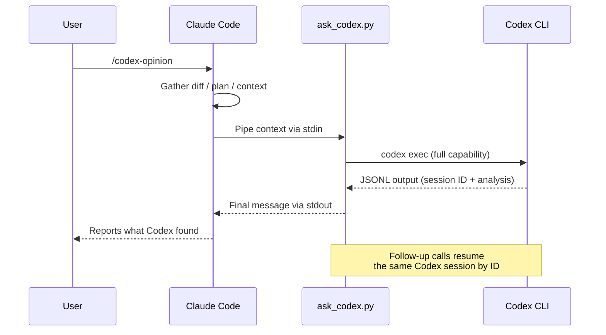

# codex-opinion

A Claude Code plugin that gets a second opinion from OpenAI's Codex CLI on your work.

When you invoke `/codex-opinion`, Claude pipes your diff, plan, or context to `codex exec` running at full capability. Codex reads the codebase, runs commands, and does deep analysis. Claude reads the response and reports back.

Codex maintains session continuity by storing the exact session ID — follow-up calls resume that session so Codex builds on its prior analysis.

## How it works



## Prerequisites

- [Claude Code](https://claude.ai/code) installed
- [OpenAI Codex CLI](https://developers.openai.com/codex/cli) installed and authenticated (`npm i -g @openai/codex`)

## Install

Add this repo as a plugin marketplace in your Claude Code settings (`~/.claude/settings.json`):

```json
{
  "extraKnownMarketplaces": {
    "codex-opinion": {
      "source": {
        "source": "github",
        "repo": "ehzawad/codex-opinion"
      }
    }
  }
}
```

Then install the plugin:

```bash
claude plugins install codex-opinion@codex-opinion
```

That's it. The plugin persists across sessions — no flags needed.

### For development

If you're hacking on the plugin itself, load it directly for a single session:

```bash
git clone https://github.com/ehzawad/codex-opinion.git
claude --plugin-dir ./codex-opinion/plugins/codex-opinion
```

## Usage

In any Claude Code session:

```
/codex-opinion
```

With a custom instruction:

```
/codex-opinion focus on security vulnerabilities
```

Claude gathers the relevant context, pipes it to Codex, and reports back what Codex found.

## License

MIT
