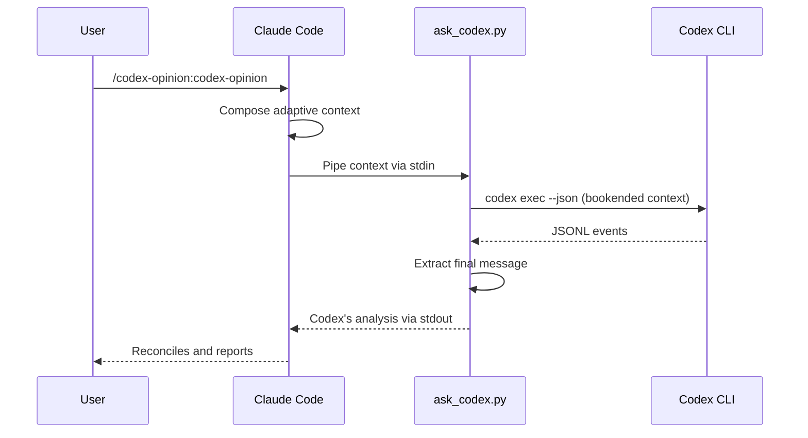

# codex-opinion

A Claude Code plugin that brings OpenAI's Codex CLI into your work as a distinct second model. You, Claude, and Codex in the loop. Install once; invoke from any Claude Code project.

## Prerequisites

- [Claude Code](https://claude.ai/code) — authenticated (`claude` in terminal)
- [OpenAI Codex CLI](https://developers.openai.com/codex/cli) — authenticated (`codex` in terminal)

Both must be logged in and working in your terminal before using this plugin.

## Install

```bash
claude plugins marketplace add ehzawad/codex-opinion
claude plugins install codex-opinion@codex-opinion
```

Persists across sessions — no flags needed.

> Iterating on the plugin itself? See [For development](#for-development) for the author dev loop (symlink + SessionStart hook).

## Usage

```
/codex-opinion:codex-opinion
```

Add a directive in the same turn to steer the collaboration:

```
/codex-opinion:codex-opinion focus on migration risks
```

Claude Code also triggers the skill automatically when you ask in natural language — no slash command needed:

```
ask codex what it thinks
get a second opinion on this approach
have codex weigh in
another perspective on the trade-off
reconcile with codex
```

## How it works

The script bookends Claude Code's stdin context with a short generic review directive, then sends the combined prompt into `codex exec` (or `codex exec resume` when a prior session exists). Pass a positional argument to replace the default directive, or `--no-default-instruction` for exact stdin passthrough. Claude Code still composes the full context every call — adapted to the current task, phase, and recent turns. On the first call per project, Claude's context establishes Codex's framing; follow-up calls resume the same Codex thread so Codex carries accumulated project knowledge. Claude reframes explicitly when the task shifts so prior framing doesn't bias later turns.

Codex uses your configured model and settings from `~/.codex/config.toml`, reads the current project directly, runs commands, and does deep analysis. Claude reconciles Codex's response against its own assessment — agreements, specific disagreements, missed points — and reports the reconciled output to you. When Claude's reconciliation adds material new judgment or synthesis, it can ask Codex to audit the draft, and if that audit materially changes the answer, run one closing check on the revision. The protocol stays bounded — initial round, audit when needed, closing check when needed — rather than iterating toward agreement.



## Philosophy

Every invocation is a three-way reconciliation: send material context (don't dump, don't summarize away specifics), make uncertainty explicit, and reconcile assumptions across Claude, Codex, and the human. The full invariants — keep the context window useful, treat unexpected state calmly, no shortcuts over correctness, no overclaiming, thoughtful over fast, surface disagreement over default agreement, and treating wrong/missing/incomplete assumptions as the origin of errors — are the baked-in floor in [`SKILL.md`](plugins/codex-opinion/skills/codex-opinion/SKILL.md).

## Session management

One Codex session per project, stored at `$XDG_STATE_HOME/codex-opinion/{project-hash}.json` (default `~/.local/state/codex-opinion/...`). Follow-up calls resume the prior Codex thread so it builds on its accumulated project knowledge — across Claude Code sessions, not just within one.

Resume failures are handled conservatively. Only known stale-session errors (the stored thread is missing or expired server-side) trigger a fresh restart. Other failures — auth, network, config, or a clean exit with no agent message — are reported with their stderr and the script exits non-zero. This avoids silently re-running prompts that may have non-idempotent side effects under Codex's full filesystem access.

Set `CODEX_OPINION_SESSION_KEY` before launching Claude Code to scope state to that session — the state file becomes `{project-hash}-{session-hash}.json` and the session gets its own Codex thread. Unset or empty keeps the default project-wide thread, which preserves accumulated project knowledge across Claude Code sessions. Use a non-secret label (e.g. a branch name or short task ID) — the raw value is written into the state file for debugging.

Concurrent invocations across *different* projects are fully isolated — each project keys to its own state file and therefore its own Codex thread. Concurrent invocations on the *same* project share state by default: writes to the JSON file are atomic (it never corrupts), but every caller resumes the same remote Codex thread. Parallel same-project turns can interleave and muddle the output. Net cost is a possibly-confused opinion or a wasted re-learning round, never lost work. To isolate parallel same-project sessions instead of sharing, give each one a different `CODEX_OPINION_SESSION_KEY`.

See [DESIGN.md](DESIGN.md) for the session-management flowchart and JSONL protocol diagram.

## Security

Codex runs with `--dangerously-bypass-approvals-and-sandbox` — no approval prompts, no filesystem sandbox. This gives Codex full read/write access to your machine so it can thoroughly inspect and analyze the current project. Do not use this plugin on untrusted projects or with untrusted input.

## Configuration

The script uses your Codex CLI defaults — model, reasoning effort, and other settings come from `~/.codex/config.toml`. No model is hardcoded. Sandbox and approval settings are overridden by the plugin (see Security above).

No subprocess timeout is enforced. Real failures surface via non-zero exit or a clean exit with no agent message (both handled).

## For development

Two options depending on how you iterate.

**Per-session try-out** — loads from disk for one session, no persistence:

```bash
git clone https://github.com/ehzawad/codex-opinion.git
claude --plugin-dir ./codex-opinion/plugins/codex-opinion
```

**Persistent dev loop** — for authors iterating on the plugin itself, so edits to the working tree are live without the commit/push/`plugins update`/restart cycle:

```bash
git clone https://github.com/ehzawad/codex-opinion.git
cd codex-opinion
claude plugins marketplace add ehzawad/codex-opinion    # skip if already added
claude plugins install codex-opinion@codex-opinion       # skip if already installed
./scripts/dev-link.sh
# restart Claude Code once
```

`scripts/dev-link.sh` does three things:

1. Creates a symlink at `~/.claude/plugins/cache/codex-opinion/codex-opinion/<version>/` → this repo's working tree, so edits are live at runtime.
2. Rewrites `~/.claude/plugins/installed_plugins.json` so the harness's `installPath` and `version` fields point at the symlinked version.
3. Prunes any stale sibling entries in the cache dir for other versions, so bumping `plugin.json` and re-running dev-link doesn't leave old directories or symlinks behind.

Step 2 is load-bearing: the harness loads whichever `installPath` the manifest declares, **not** whichever symlinks exist in the cache. Without the manifest rewrite, bumping the version in `plugin.json` and re-running dev-link creates a new symlink that the harness will happily ignore.

After the one-time restart, edits to `plugins/codex-opinion/**` are live on the next `/codex-opinion:codex-opinion` invocation. **SKILL.md caveat:** the Claude Code harness's skill-content caching behavior is not documented, so `SKILL.md` edits may still require a session restart; the script and the rest of the plugin files update live.

**Startup-overwrites-symlink caveat.** Claude Code re-validates the plugin cache on every session start and **replaces the symlink with a freshly-fetched copy from origin**. The documented "symlinks are preserved" property applies to runtime resolution, not startup validation. Two ways to handle it:

1. **Manual:** re-run `./scripts/dev-link.sh` after every Claude Code restart, any `claude plugins update`, any version bump in `plugin.json` (the cache path changes with the version), or any cache wipe.
2. **Automatic (recommended):** add a `SessionStart` hook to `~/.claude/settings.json` so the symlink is re-established on every session:

```json
{
  "hooks": {
    "SessionStart": [
      {
        "matcher": "",
        "hooks": [
          {
            "type": "command",
            "command": "bash -c '/absolute/path/to/codex-opinion/scripts/dev-link.sh >/dev/null 2>&1 || true'"
          }
        ]
      }
    ]
  }
}
```

Failures are swallowed (`|| true`) so a missing repo or broken script never blocks session startup. Merge into your existing `hooks.SessionStart` array if you already have one (don't replace it).

## License

MIT
